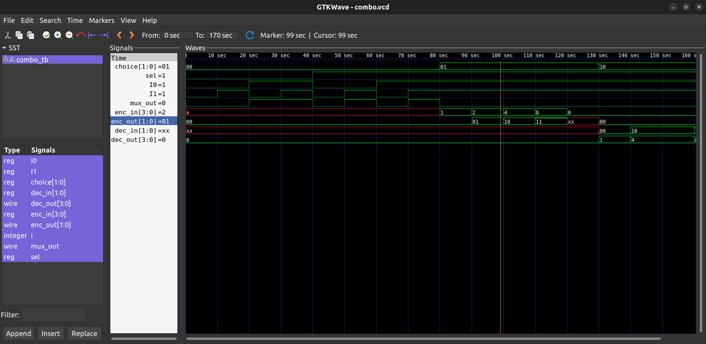

# Combo Module Project

This project demonstrates a **combo module** that integrates three fundamental digital components:  
- 2-to-1 Multiplexer (`mux_2_1`)
- Encoder
- Decoder

All modules are written in **Verilog HDL** and verified through simulation and waveform analysis.  
Synthesis is performed using **Yosys**.

---

##  Project Structure

  ├── src/
  │   ├── combo.v         # Top-level combo module 
  │   ├── mux_2_1.v       # 2-to-1 multiplexer
  │   ├── encoder.v       # Encoder module
  │   └── decoder.v       # Decoder module
  ├── tb/
  │   └── combo_tb.v      # Testbench for the combo module
  ├── waveform/
  │   ├── combo.vcd       # VCD file generated after simulation
  │   └── waveform.png    # Optional GTKWave snapshot image
  ├── synth/
  │   ├── combo_script.ys # Yosys synthesis script
  │   └── combo_synth.v   # Synthesized netlist output from Yosys
  └── README.md           # Project documentation (this file)

---

##  How to Simulate

1. **Compile and Simulate** with Icarus Verilog:
   ```bash
   iverilog -o combo.vvp -v src/*.v tb/combo_tb.v
   vvp combo.vvp

2. View Waveform with GTKWave:

   gtkwave waveform/combo.vcd


---

Testbench

File: tb/combo_tb.v

Applies stimulus to the combo module and dumps waveform data.

Outputs a .vcd file viewable in GTKWave.


---

Synthesis

Synthesis is performed using Yosys.

🔹 Files

synth/combo_script.ys: Yosys script to read the Verilog source, synthesize, and write the netlist.

synth/combo_synth.v: Synthesized output netlist generated from Yosys.


🔹 To Run Synthesis

yosys synth/combo_script.ys

This command reads the Verilog files, performs logic synthesis, and generates combo_synth.v.


---

Module Overview

🔸 combo.v

Top-level module that instantiates and connects:

mux_2_1: 2-input MUX

encoder: Converts one-hot input to binary

decoder: Converts binary back to one-hot


🔸 mux_2_1.v

Inputs: in0, in1, sel

Output: out


🔸 encoder.v

Input: one-hot

Output: binary code


🔸 decoder.v

Input: binary code

Output: one-hot


---

Waveform

combo.vcd: Simulation output for GTKWave

waveform.png: snapshot image of waveform view


> Sample Waveform

---

📌 Requirements

Icarus Verilog – for simulation

GTKWave – for waveform viewing

Yosys – for synthesis


---

License

This project is for educational and demonstration purposes.
Feel free to reuse and modify for learning or integration into other projects.
